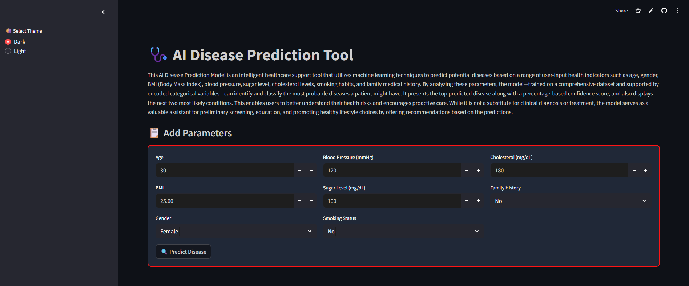
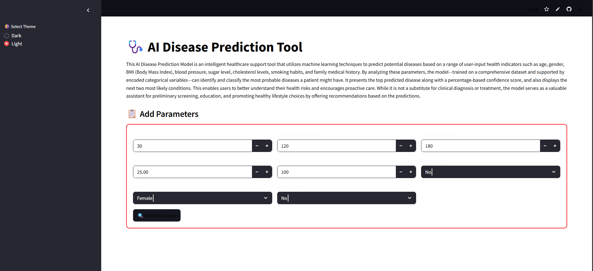
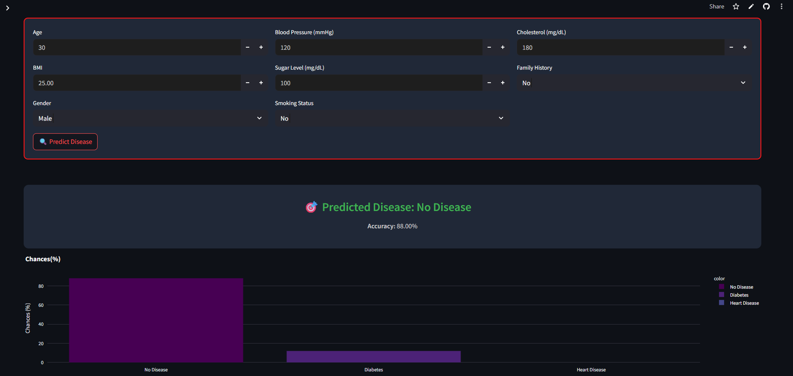
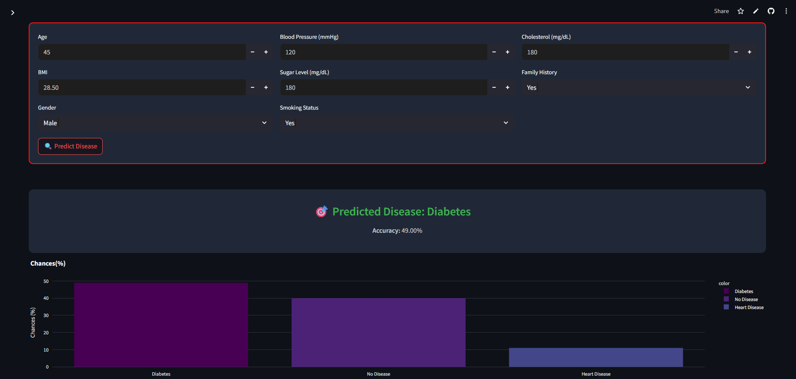

---

# 🩺 AI Disease Prediction Tool

The **AI Disease Predictor** is a web-based application built using **Streamlit** that predicts potential diseases based on various health parameters entered by the user. This intelligent tool is powered by a machine learning model trained on anonymized patient data and provides users with the top disease prediction, associated confidence scores, and health recommendations.

---

## 🚀 Features

* 🔮 Predicts the most probable disease based on input health metrics
* 📊 Displays confidence level and top 3 predictions with a visual chart
* 🌗 Toggle between Dark and Light mode themes
* ✅ Intuitive UI with organized input sections
* 📋 Personalized recommendations based on the predicted disease

---
## 💻 Demo

👉 [Click here to use the app](https://disease-prediction-bkxku22aqtvjbqtcb9kvcu.streamlit.app/)

Experience the AI-powered Disease Prediction Tool live in your browser!
---
## 📦 Tech Stack

* **Frontend**: [Streamlit](https://streamlit.io)
* **Backend**: Python (scikit-learn model)
* **Visualization**: Plotly
* **Model Serialization**: Joblib
* **Input Encoding**: Label Encoders

---

## 🧠 Model Overview

This AI Disease Prediction Model is an intelligent healthcare support tool that utilizes machine learning techniques to predict potential diseases based on a range of user-input health indicators such as age, gender, BMI, blood pressure, sugar level, cholesterol, smoking habits, and family medical history. It returns the most likely disease with a probability score, along with the top 3 predictions, to guide users in understanding their health risks and encourage preventive care. The tool also provides lifestyle recommendations based on the predicted result.

---

## 📥 Installation

### 1. Clone the repository

```bash
git clone https://github.com/your-username/ai-disease-predictor.git
cd ai-disease-predictor
```

### 2. Create virtual environment (optional but recommended)

```bash
python -m venv venv
source venv/bin/activate  # On Windows: venv\Scripts\activate
```

### 3. Install dependencies

```bash
pip install -r requirements.txt
```

### 4. Run the app

```bash
streamlit run app.py
```

---

## 🧾 Files and Directories

| File/Folder        | Description                             |
| ------------------ | --------------------------------------- |
| `app.py`           | Main Streamlit app file                 |
| `model.pkl`        | Trained machine learning model          |
| `encoders.pkl`     | Label encoders for categorical features |
| `requirements.txt` | Python dependencies for the project     |

---

## 🖼️ Screenshots
# Dark Mode:

# Light Mode:

# Condition of no disease:

# Condition of a disease:



---

## 🔒 Disclaimer

This tool is intended **only for educational and awareness purposes**. It does not replace professional medical advice or diagnosis. Always consult with a certified healthcare provider for accurate diagnosis and treatment.

---

## 📫 Contact

For feedback or questions, please reach out:

* **GitHub**: [supratik-7](https://github.com/supratik-7)
* **Email**: [supratikdatta766@gmail.com](mailto:supratikdatta766@gmail.com)

---


